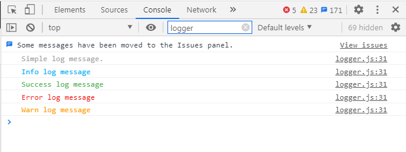
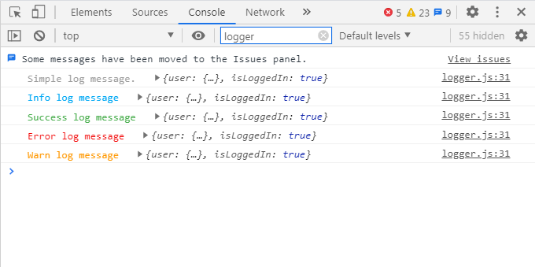

# Pretty JS Logger

See pretty javascript logs in the console.

## Installation

```sh
npm i pretty-js-logger
```

## Usage

### Example 1: Simple Log Messages

Below is the simple example which dispaly the log messages.

```js
import { log, info, success, error, warn } from 'pretty-js-logger';

// Simple log with log message.
log('Simple log message.');

info('Info log message');

success('Success log message');

error('Error log message');

warn('Warn log message');
```

**Screenshot**



### Example 2: Log Message with Data

Below is the example with log message with log data.

```js
import { log, info, success, error, warn } from 'pretty-js-logger';

const data = {
	user: {
		name: 'Mahesh M. Waghmare',
		email: 'mwaghmare7@gmail.com',
	},
	isLoggedIn: true,
};


// Log message with log data.
log('Simple log message.', data );

info('Info log message', data );

success('Success log message', data);

error('Error log message', data);

warn('Warn log message', data);
```

**Screenshot**

